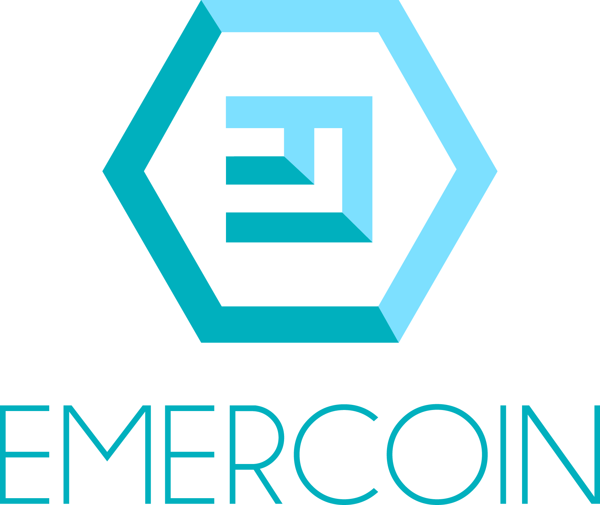

 

Emercoin is a [blockchain](https://en.wikipedia.org/wiki/Blockchain) platform supporting a wide range of distributed trusted services. Distinctive features include high reliability, robustness and 3-in-one hybrid mining (PoW+MergedMining+PoS). Currently, the Emercoin platform already runs the network security services
[EmerSSL](./Blockchain_Services/EmerSSL/EmerSSL_Introduction)/[EmerSSH](./Blockchain_Services/EmerSSH), decentralized
domain system [EmerDNS](./Blockchain_Services/EmerDNS/EmerDNS_Introduction), an anti-counterfeit solution
[EmerDPO](./Blockchain_Services/EmerDPO/EmerDPO_Introduction), VOIP solution [ENUMer](./Blockchain_Services/ENUMer), as well as several other [bundled blockchain services](./Blockchain_Services/Introduction_to_Emercoin_Services). At the heart of many of these innovations is the [Emercoin NVS](./Blockchain_Services/Emercoin_NVS) which allows for the arbitrary storage of **name-&gt;value** pairs on the blockchain.

The official project website can be found at
[emercoin.com](http://emercoin.com)
