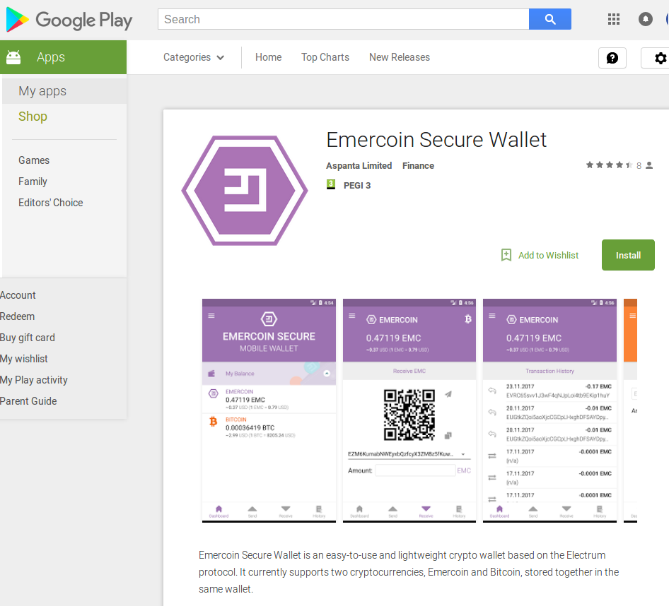

# Emercoin Secure Wallet

 

<strong>Emercoin Secure Wallet</strong> is a lightweight and secure client app for Android, iOS, Windows, Linux and MacOS. Unlike the already announced Emercoin One/Basic, it
stores keys locally and uses the Electrum protocol.

Emercoin SW is released by Aspanta Limited.

-   [Emercoin SW
    Announcement](https://medium.com/@emer.tech/emercoin-secure-wallet-1-0-53454d8cfca1)
-   [Google Play
    Store](https://play.google.com/store/apps/details?id=com.aspanta.emcsec) (Android)
-   [Apple Appstore](https://itunes.apple.com/us/app/emercoin-secure-wallet/id1273529858) (iOS)
-   [Desktop](https://download.emercoin.com/apps/EmcSec/latest) (Windows, Linux, MacOS)

