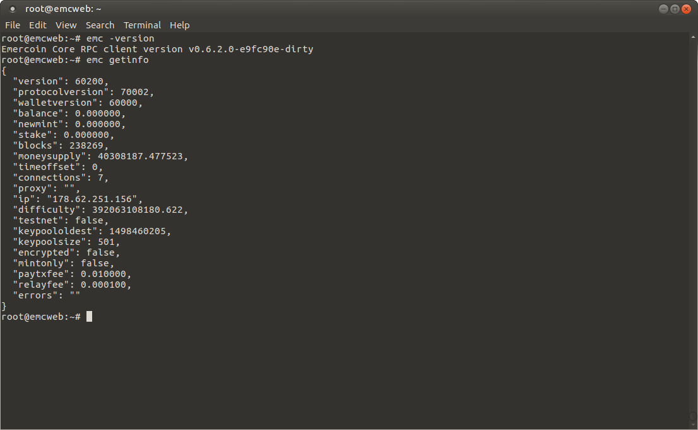

## Emercoin Command Line Daemon (headless)

<div style="overflow:hidden;"></div><br>

The latest emercoin daemon can be installed as a system service via repositories for the most popular flavors of Linux:

### For Ubuntu 16.04 LTS (x64)

```bash
$ apt-key adv --keyserver keyserver.ubuntu.com --recv B58C58F4
$ add-apt-repository 'deb http://download.emercoin.com/ubuntu xenial emercoin'
$ apt update && apt -y install emercoin
```
### For Ubuntu 14.04 (x64)
```bash
$ apt-key adv --keyserver keyserver.ubuntu.com --recv B58C58F4
$ add-apt-repository 'deb http://download.emercoin.com/ubuntu trusty emercoin'
$ apt-get update && apt-get -y install emercoin
```
### For Debian 8 (x64, armhf)
```bash
$ apt -y install software-properties-common
$ apt-key adv --keyserver keyserver.ubuntu.com --recv B58C58F4
$ add-apt-repository 'deb http://download.emercoin.com/debian jessie emercoin'
$ apt update && apt -y install emercoin
```
### For RHEL/CentOS 7 (x64)
```bash
$ rpm -ivh http://download.emercoin.com/rhel/el7/RPMS/emercoin-release-1.0-1.el7.centos.noarch.rpm
$ yum -y install emercoin
$ systemctl restart emercoind
$ systemctl enable emercoind
```
After installation, the emercoin daemon can be invoked by typing`emc`, or controlled as a system service. e.g:

	$ emc getinfo

For command help:

	$ emc help

For runtime options, type:

	$ emc -help

To stop the daemon in Ubuntu:

	service emercoind stop

To start the daemon in Ubuntu:

	service emercoind start

To restart the daemon in Ubuntu:

	service emercoind restart

