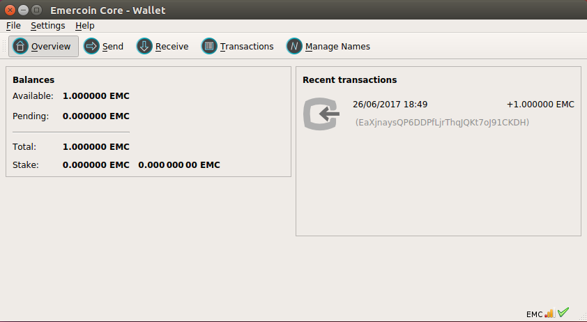

# Emercoin Core
The Emercoin core wallet comes in three main flavors, as outlined on this page:
 - a GUI wallet for use on the desktop.
 - a 'headless' command-line server version.
 - EmcWEB, a browser-based wallet front-end and headless daemon running on your own server.

They are compatible, and take the same command-line arguments, read the same configuration file, and read and write the same data files.

Source code for Emercoin Core can be found on the [project GitHub](https://github.com/Emercoin).

After you have installed Emercoin Core, see [Running Emercoin](../General_Usage/Running_Emercoin).

## GUI wallet

<div style="overflow:hidden;"></div>

The latest GUI for Linux, OSX, and Windows, can be downloaded from [Emercoin's offical page on Sourceforge](https://sourceforge.net/projects/emercoin/files).

## Linux command-line daemon (headless)

<div style="overflow:hidden;"></div>

The latest emercoin daemon can be installed as a system service via repositories for the most popular flavors of Linux:

### For Ubuntu 16.04 LTS (x64)

```bash
$ apt-key adv --keyserver keyserver.ubuntu.com --recv B58C58F4
$ add-apt-repository 'deb http://download.emercoin.com/ubuntu xenial emercoin'
$ apt update && apt -y install emercoin
```
### For Ubuntu 14.04 (x64)
```bash
$ apt-key adv --keyserver keyserver.ubuntu.com --recv B58C58F4
$ add-apt-repository 'deb http://download.emercoin.com/ubuntu trusty emercoin'
$ apt-get update && apt-get -y install emercoin
```
### For Debian 8 (x64, armhf)
```bash
$ apt -y install software-properties-common
$ apt-key adv --keyserver keyserver.ubuntu.com --recv B58C58F4
$ add-apt-repository 'deb http://download.emercoin.com/debian jessie emercoin'
$ apt update && apt -y install emercoin
```
### For RHEL/CentOS 7 (x64)
```bash
$ rpm -ivh http://download.emercoin.com/rhel/el7/RPMS/emercoin-release-1.0-1.el7.centos.noarch.rpm
$ yum -y install emercoin
$ systemctl restart emercoind
$ systemctl enable emercoind
```
After installation, the emercoin daemon can be invoked by typing`emc`, or controlled as a system service. e.g:

	$ emc getinfo

For command help:

	$ emc help

For runtime options, type:

	$ emc -help

To stop the daemon in Ubuntu:

	service emercoind stop

To start the daemon in Ubuntu:

	service emercoind start

To restart the daemon in Ubuntu:

	service emercoind restart

*For more information see [Running Emercoin](../General_Usage/Running_Emercoin) and [Emercoin API](../General_Usage/Emercoin_API).*

## EmcWEB wallet

<div style="style=”width:50%”"></div><div style="style=”width:50%”"></div>

<br>

EmcWEB is an emercoin daemon, EmcSSH installation, and web wallet configured for fast deployment on the Microsoft Azure platform, or hosted on your own server.

### Fast Deploy EmcWEB on Microsoft Azure Marketplace

For fast deployment on Azure, click the following button.
<div style="overflow:hidden;"><a href="https://azure.microsoft.com/marketplace/partners/emercoin/emercoin/"></a></div>

<br>

### Deploy EmcWEB on your own server

Minimum system requirements are: 1 GB RAM or 512 MB RAM + SWAP 1 GB 

#### For Ubuntu 16.04 LTS (x64)
```bash
$ apt-key adv --keyserver keyserver.ubuntu.com --recv B58C58F4
$ add-apt-repository 'deb http://download.emercoin.com/ubuntu xenial emercoin'
$ apt update && DEBIAN_FRONTEND=noninteractive apt -y install mysql-server redis-server && apt -y install emcweb
$ emcweb-setup -C
```
Optionally, to quickly create a login and password to enter the web-wallet, use the command <code>emcweb-setup -G -C -R = ‘YOUR_MYSQL_ROOT_PASSWORD’</code> (Where ‘YOUR_MYSQL_ROOT_PASSWORD’ is the password of the user ‘root’ in MySQL that you specified during the installation process).

After executing these commands, you need to go to the IP address of the web server and continue to configure emcweb already through the web interface.
Parameters for connecting to Emercoin RPC can be taken from the file <code>/etc/emercoin/emercoin.conf</code>
 
#### For RedHat/CentOS 7:
```bash
$ rpm -ivh http://download.emercoin.com/rhel/el7/RPMS/emercoin-release-1.0-1.el7.centos.noarch.rpm
$ yum -y install mariadb-server redis emcweb
$ systemctl restart emercoind httpd supervisord redis mariadb
$ systemctl enable  emercoind httpd supervisord redis mariadb
$ emcweb-setup -C
```
* Optionally, to quickly create a login and password to enter the web-wallet, use the command <code>emcweb-setup -G -C</code>
After executing these commands, you need to go to the IP address of the web server and continue to configure emcweb already through the web interface.
Parameters for connecting to Emercoin RPC can be taken from the file <code>/etc/emercoin/emercoin.conf</code>

After that, you can point your browser to the server’s IP and follow instructions to continue setup.
Please note: SElinux is not supported!

#### For Debian 8 (x64, ARM)
```bash
$ apt-key adv --keyserver keyserver.ubuntu.com --recv B58C58F4
$ echo "deb http://download.emercoin.com/debian jessie emercoin" > /etc/apt/sources.list.d/emercoin.list
$ apt update && DEBIAN_FRONTEND=noninteractive apt -y install mysql-server redis-server && apt -y install emcweb
$ emcweb-setup -C
```
* Optionally, to quickly create a login and password to enter the web-wallet, use the command <code>emcweb-setup -G -C -R = ‘YOUR_MYSQL_ROOT_PASSWORD’</code> (Where ‘YOUR_MYSQL_ROOT_PASSWORD’</code> is the password of the user ‘root’ in MySQL that you specified during the installation process).

After executing these commands, you need to go to the IP address of the web server and continue to configure emcweb already through the web interface.
Parameters for connecting to Emercoin RPC can be taken from the file <code>/etc/emercoin/emercoin.conf</code>

