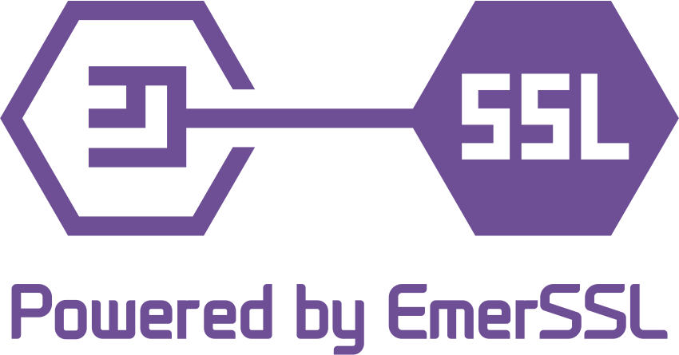

 

# EmcSSL

EmcSSL is a system for passwordless website login and identification
using the Emercoin blockchain as a decentralized
trust store of hash sums for client
[SSL-certificates](https://en.wikipedia.org/wiki/SSL_Certificates). Certificates can be generated by users on their own computer, without
any central authority, and quickly replaced as needed. This makes the
system effective both for scheduled replacement and rapid recall of
compromised certificates.

The advantage provided by EmcSSL is in the complete decentralization of
the system, i.e. the lack of a group of servers running under a single
authorization (as used in the systems of
[Kerberos](https://en.wikipedia.org/wiki/Kerberos_(protocol)),
[OpenID](https://en.wikipedia.org/wiki/OpenID), TeddyID and the like). Due to this decentralization it is not possible for EmcSSL to suffer a
system-wide service disruption either due to technical failure or
malicious attack upon authorization servers. In addition, it is not
possible for a user to have their accounts globally suspended at the
whim of a single authority.

Associated with the EmcSSL technology is [EmcSSL
InfoCard](EmcSSL_InfoCard) - a "business card" system that
complements EmcSSL's passwordless logins by allowing website profiles to
be automatically populated from data residing on the Emercoin
blockchain.

EmcSSL resources
----------------

Visit the following EmcSSL resources:

-   [EmcSSL white paper](http://emercoin.com/content/EMCSSL.pdf)
-   [EmcSSL InfoCard](EmcSSL_InfoCard)
-   [EmcSSL Guide](EmcSSL_Guide)
-   [EmcSSL toolkit page](https://pool.emercoin.com/emcssl/)
-   [EmcSSL and Infocard module for
    Drupal](https://www.drupal.org/project/emc_ssl)
-   [EmcSSL certificate generator](https://emcssl.org) (Russian)
-   [EmcSSL on Github](https://github.com/emercoin/emcssl)

