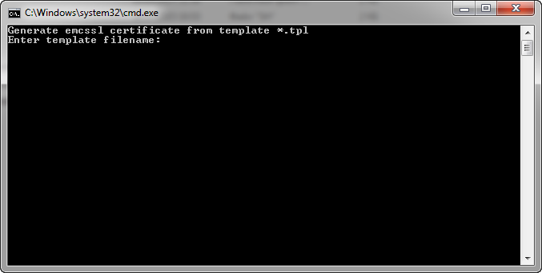

<div style="overflow:hidden;"></div>
<br>

# EmerSSL Guide

This article will guide you through step by step instructions for using
[EmerSSL](EmerSSL_Introduction) to create a new certificate and use it to
log in without a password to a website that supports it. The guide assumes you are running the <b>Emercoin GUI wallet</b> and have some [EMC](../../Introduction/The_EMC_Currency) in your wallet balance.

	Follow these steps:

	1. First, download the [EmerSSL bundle](https://pool.emercoin.com/emcssl/)
	(or get the latest from [GitHub](https://github.com/emercoin/emcssl)).

	2. Next, create an Emercoin [InfoCard](EmerSSL_InfoCard) on the
	Emercoin blockchain. Creating an InfoCard is optional, but can be useful
	if you would like to auto-fill some default info about yourself with
	each website you create a login for.

	3. Template Generation: To generate a template in Linux, the script **gen_tpl.sh** is used,
	which is in the same [bundle](https://pool.emercoin.com/emcssl/) as the InfoCard. Unpack the archive with the script, open a terminal and go to the folder X509, and run **gen_tpl.sh**.

    ```
    $ cd downloads/X509
    $ ./gen_tpl.sh
    ```

   If in Windows, run **gen_tpl.bat**.

   

   The program prompts you to enter the data to be used for the certificate:
    -   **CommonName** - login (username). The only required parameter.
    -   **Email** - your mail, leave this empty.
    -   **UID** - a reference to additional information about the owner of
    the certificate, such as InfoCard. If you created [InfoCard](EmerSSL_InfoCard), enter the UID data (obtained when generating the *.ze file):
        - info: e120319a479f4ac4: ac7c3821f171b6a8bd8cd33d829f5b<br><br>

   If all goes well, you will see the following entry:

    ```
    Created EmerSSL Certificate template: ceabec4544e2ab86.tpl
    ```

4. Certificate generation: Now we need to run the script **gen_crt.sh** with the obtained parameter:

    ```
    ./gen_crt.sh ceabec4544e2ab86.tpl
    ```

   In Windows, run **gen_crt.bat**

   

   The script asks you to enter a password to import the certificate into the browser. You must enter a password and confirm it. Then you will see the message:

    ```
    Please, deposit into Emercoin NVS pair:
    Key: ssl:ceabec4544e2ab86
    Value: sha256=2c2de184a316be17d8170312bca336a22bfda97d10f56d4127ca31d0253d8097 
    ```
   Open the wallet tab **Manage Names** and copy Key into the **Name** field and Value in the **Value** field, and click Submit. The **New address** field should be left blank.

   

5. Import the certificate into the browser: Now the certificate obtained in the previous section (and which should appear in the folder with the script) is to be imported into the browser. The certificate has the extension *.p12. OSX users should just double click on the file. This opens Keychain Access and asks you to enter the password you gave when generating the certificate. For other operating systems, everything happens similarly. Importing a certificate doesn't differ from normal client SSL-certificates, and is done through the appropriate setup menu of the browser. Here are guidelines for some common browsers:
    - [Firefox](http://www.onlinehowto.net/install-ssl-certificate-in-firefox/784),
    - [Chrome](http://www.binarytides.com/client-side-ssl-certificates-firefox-chrome/),
    - [IE](http://ipswitchmsg.force.com/kb/articles/FAQ/Using-client-SSL-certificates-in-Internet-Explorer-1307739573570).<br><br>

6. Verifying the certificate: You can check the operation of the certificate in the Emercoin pool. To
get started, click [here](https://pool.emercoin.com/emcssl/InfoCard.php). If you see something like this, it means everything is in order:
    ```text
    pid=30275
    main: SSL-certificate presented

    SerialNo: FD493EAEEA64B563
    Currency: EMC
    CommName: kamillo
    e-Mail : kamillo@example.com
    InfoCard:

    EmerSSL_validate() RETURNED: $EX4WHi2ABUkinKX6jACUxanhMqDYbbcyEj
    ```
   Now go to the [registration page](https://pool.emercoin.com/register) of
the pool and click **Register with EmerSSL.** The system should tell us
that the registration was successful. Then click **Login with EmerSSL**
to authorize yourself on the site.

   Congratulations on using EmerSSL to log in to a website without entering a password!

If you have questions, feel free to ask.


