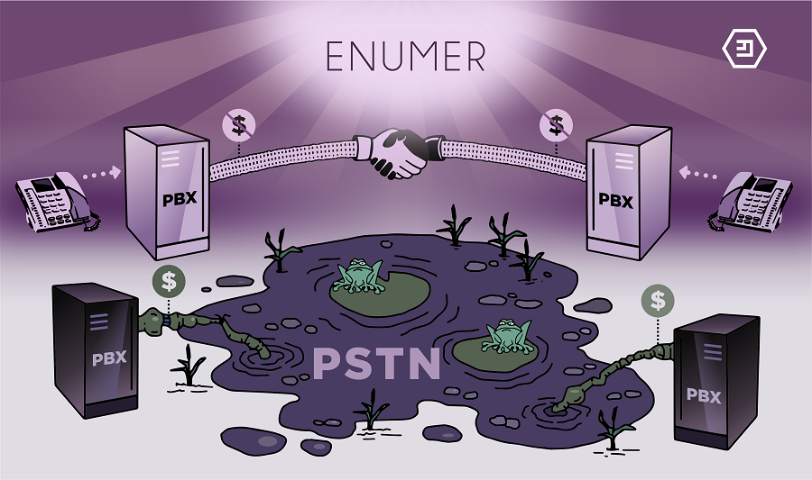

<div style="overflow:hidden;"></div>
<br>

ENUMer is a system for supporting [ENUM telephone
records](http://www.voip-info.org/wiki/view/ENUM) on Emercoin's
blockchain, under the **"enum"** service abbreviation in the [Emercoin
NVS](/Emercoin_NVS).

ENUMer Introduction
-------------------

ENUM (E.164 Number to URI Mapping)
translates telephone numbers into Internet addresses, for use by [SIP
Proxies](https://en.wikipedia.org/wiki/SIP_proxy), [VoIP
gateways](https://en.wikipedia.org/wiki/VoIP_gateway), and other
specialised telephony systems.

A softswitch can send ENUM requests to a wallet:

    $ dig -t naptr +short 08068886681.enum
    100 10 "u" "E2U+sip" "!^(.*)$!sip:\\1@tollfree.alcazarnetworks.com!" .

or public ENUMer gateway:

    $ dig -t naptr +short 08068886681.enum.enumer.org
    100 10 "u" "E2U+sip" "!^(.*)$!sip:\\1@tollfree.alcazarnetworks.com!" .

### Record format

    SIG=verifier|signature E2U+sip=PRI1|PRI2|RegExp

### NVS Example

ENUM data should be stored in the following **name-&gt;value** format in
the [Emercoin NVS](../Blockchain_Services/Emercoin_NVS):

    "name" : "enum:12027139373:0"
    "value" : "SIG=ver:enum|HxQY4nUHtf+nK/btxa0jT4UuPQPKk0pyxrJuXlF8YVVFDKhY6PVcE1XiSvTOxlQryzfA1GIH2IRYk7uGHrZIbP4= E2U+sip=100|10|!.*$!sip:17772328716@in.callcentric.com

Configuration
-------------

To activate this feature, set some config params in
**[emercoin.conf](../Running_Emercoin/emercoin.conf)**:

```text
#EmerDNSallowed=.coin|.emc|.lib|.bazar           # remove Allowed TLDs without ENUM
EmerDNSallowed=$enum|.coin|.emc|.lib|.bazar      # add Allowed TLDs with ENUM
enumtrust=ver:enum
enumtollfree=@enum:tollfree
```

Retrieval
---------

Retrieving an ENUM record from the [Emercoin
NVS](/Emercoin_NVS):

    $ emc name_show enum:12027139373:0

And the result:

```text
{
 "name": "enum:12027139373:0",
 "value": "SIG=ver:enum|HxQY4nUHtf+nK/btxa0jT4UuPQPKk0pyxrJuXlF8YVVFDKhY6PVcE1XiSvTOxlQryzfA1GIH2IRYk7uGHrZIbP4=\nE2U+sip=100|10|!^.*$!sip:17772328716@in.callcentric.com!",
 "txid": "2bbc7e292c793c613a9294ae7ed080d7a31110365c085ffc566f50a8f1631cac",
 "address": "ELHNUgKZmGX5yjTYC1gKdGV33xVX6hinKq",
 "expires_in": 940325,
 "expires_at": 1158295,
 "time": 1482526025
}
```

You can view ENUM records that have already been deployed in the Emercoin
blockchain on a blockexplorer, by [clicking
here](https://emercoin.mintr.org/nvs/enum///25/0/1).

Registration
------------

To register your phone number with ENUMer (Emercoin ENUM), you will need
to:

1.  Obtain a signature (as this is not currently automated, please
    [contact the Emercoin team](http://emercoin.com/contact) for manual
    verification),
2.  Insert the signature in the **"enum"** record for your phone number
    into the [Emercoin NVS](Emercoin_NVS).

