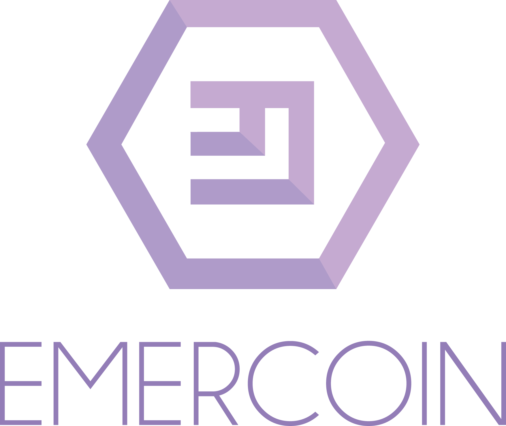
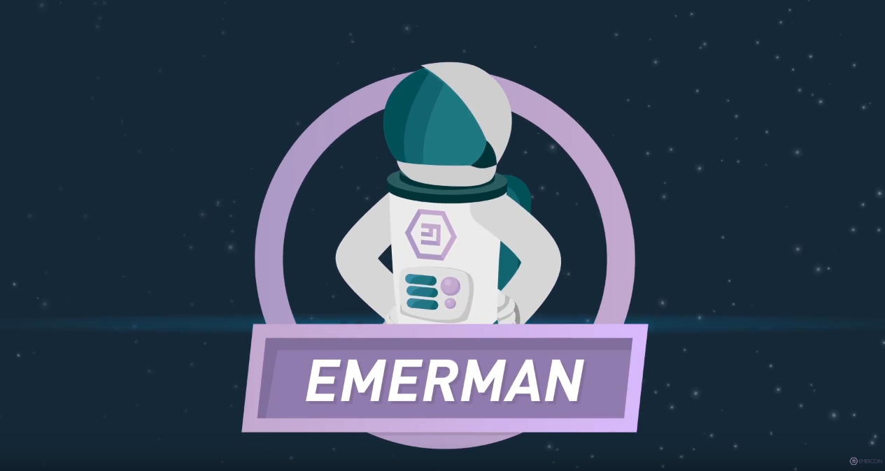
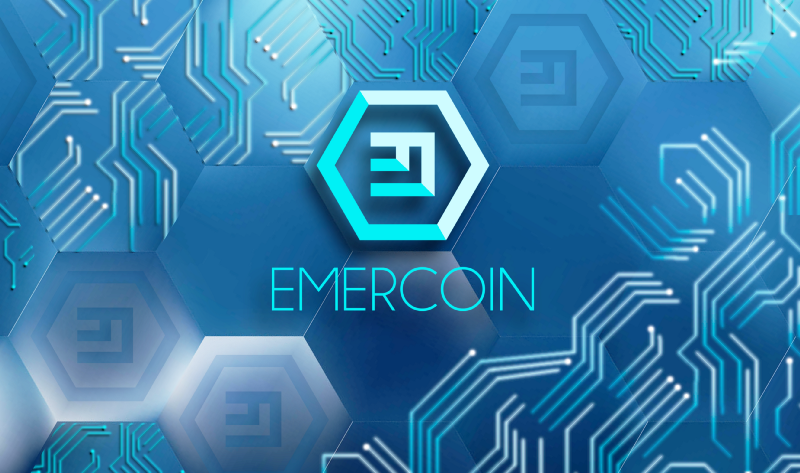
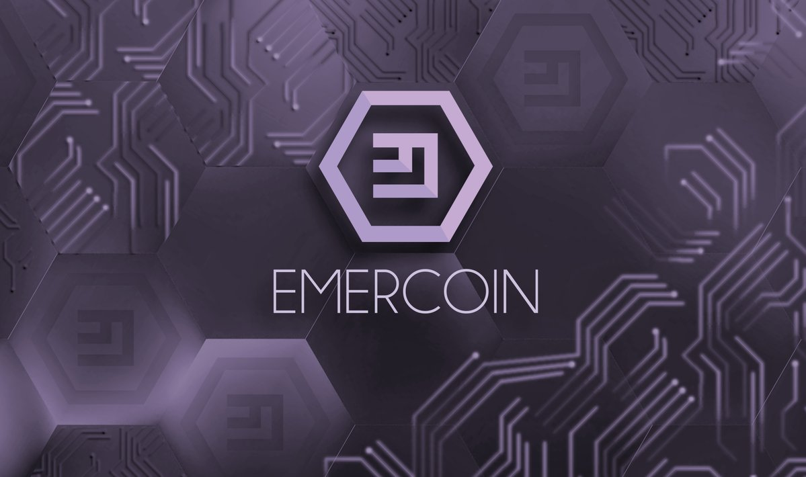
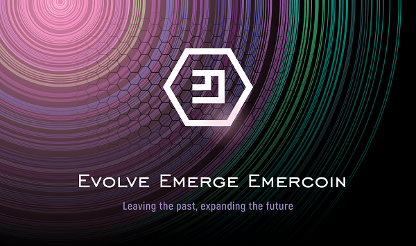
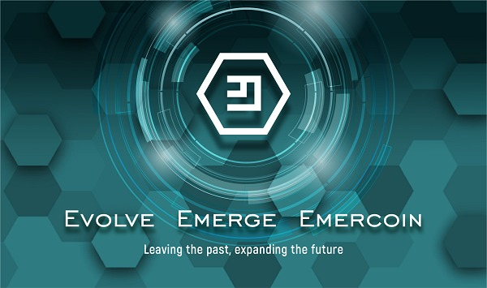
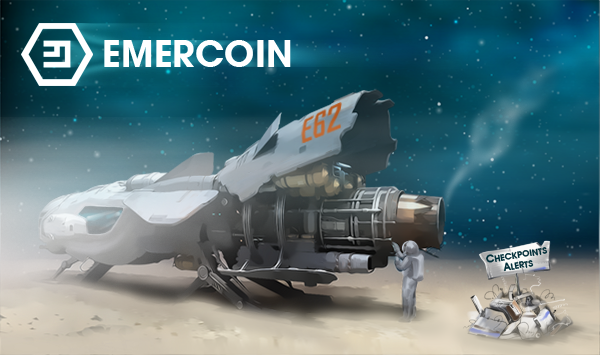
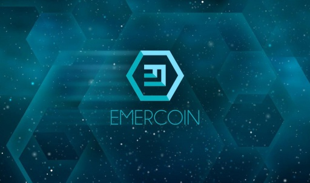
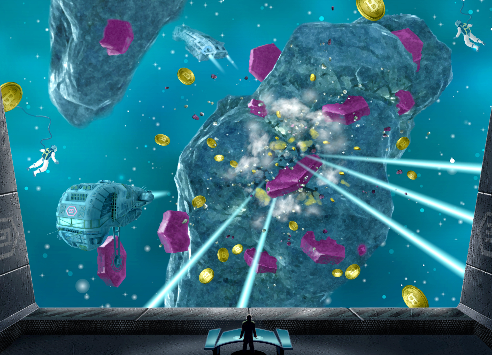
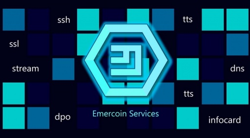

Collected graphics for Emercoin articles and media:

Emercoin Logo
-------------

Emercoin logo, square, transparent

Emercoin logo (purple), square, transparent

Emercoin logo, transparent

Emercoin logo (purple), transparent

### Vector Logo

-   [Vector version of the Emercoin
    logo](http://develop.emercoin.com/content/EMC_logo_color.ai) (Adobe
    Illustrator .ai format)

### EmerSSL Logo

EmerSSL logo

### Website Favicon

-   [favicon.ico](https://emercoin.com/favicon.ico) (website icon)

Promotional Images
------------------

Font packages that include the Emercoin logo
--------------------------------------------

-   <https://labs.allienworks.net/icons/cryptocoins/>

### Side Information

Interesting story about how Bitcoin was added to Unicode:

-   <http://www.righto.com/2016/10/inspired-by-hn-comment-four-half-star.html>
-   <http://www.coindesk.com/you-can-now-type-the-bitcoin-b-symbol-in-unicode-text/>

Unicode proposal for Bitcoin that was accepted:

-   <http://www.unicode.org/L2/L2015/15229-bitcoin-sign.pdf>

